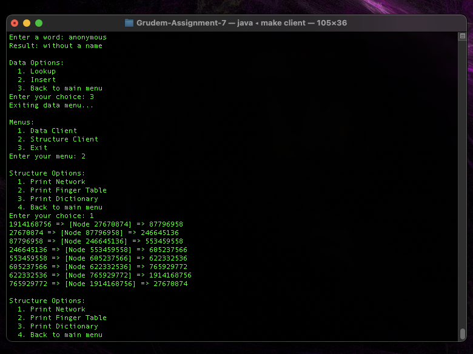

# Chord Distributed Hash Table - Java RMI
## CSCI 5105 - Homework 7
Author: Jamison Grudem  
Email: grude013@umn.edu  
Using 2 grace days

## Status Disclosure
All specified features are working and running. The program compiles, runs, and works as expected. See the following sections for more information, how to run the program, and how to analyze the results. There are no known bugs at this time.

## About The Program
This program is a simple implementation of a Chord Distributed Hash Table using Java RMI. The program starts by creating a bootstrap node that acts as the network manager. All other nodes in the network will connect to this bootstrap node to join the network. The program does not support concurrent joins to the networks as well as account for node leaves. 

The program uses a simple dictionary file (`dict.txt`) to store key-value pairs. The program will read this file and store the key-value pairs in the Chord DHT. The `DictionaryLoader` class reads in the `dict.txt` file, hashes each word, and stores the key-value (hashed word, definition) pair in the local dictionary on its corresponding node in the DHT. 

A `Client` program has also been created to interact with the Chord DHT through the command line. See <a href="#run-client">Running The Client</a> for more information.

Since this program is only a simple version of the Chord protocol, the primary supported functions for each node are:
* Join/create a network
    ```java
    /**
     * Add node `this` to the network that `estNode` is in. If `estNode` is null,
     * then `this` is the first node in the network - in this case, create a new network.
     * 
     * @param estNode The node to join with, or null if `this` is the first node
     * @return True if the node was successfully added to the network
     */
    public boolean join(INode estNode) throws RemoteException;
    ```
* Receive request to insert word and definition
    ```java
    /**
     * Given a word and definition, find the node where this should word
     * should be stored and send a message to that node to insert the word.
     * 
     * @param word The word to insert
     * @param definition The definition of the word
     * @return The id of the node where the word was inserted
     */
    public int insert(String word, String definition) throws RemoteException;
    ```
* Locally insert a word and definition
    ```java
    /**
     * Insert a key and definition into the local dictionary of the node.
     * 
     * @param key The key to insert
     * @param definition The definition of the key
     * @return True if the key was successfully inserted, false if a hash collision occurred
     */
    public boolean insertLocal(int key, String definition) throws RemoteException;
    ```
* Lookup a word and return the definition
    ```java
    /**
     * Given a word, find the node where it is stored (if present)
     * and return its definition. If the word does not exist, return null.
     * 
     * @param word The word to lookup
     * @return The definition of the word if it exists, null otherwise
     */
    public String lookup(String word) throws RemoteException;
    ```
* Find the successor of a key
    ```java
    /**
     * Given an id, find the successor node of that id
     * 
     * @param id The id to find the successor of
     * @param traceFlag Whether to print trace information
     * @return The successor node of the given id
     */
    public INode findSuccessor(int id, boolean traceFlag) throws RemoteException;
    ```
* Find the predecessor of a key
    ```java
    /**
     * Given an id, find the predecessor node of that id
     * 
     * @param id The id to find the predecessor of
     * @param traceFlag Whether to print trace information
     * @return The predecessor node of the given id
     */
    public INode findPredecessor(int id, boolean traceFlag) throws RemoteException;
    ```
* Find the closest preceding finger of a key
    ```java
    /**
     * Given an id, find the closest preceding finger of that id
     * 
     * @param id The id to find the closest preceding finger of
     * @return The closest preceding finger of the given id
     */
    public INode closestPrecedingFinger(int id) throws RemoteException;
    ```

## Project Structure
* Before compiling, the project structure is as follows:
  ```bash
  ├── .
    ├── assets      # Images used in this file and for more information
    ├── config      # Sample configuration files 
      ├── *.txt         
    ├── src         # Source code
      ├── *.java      
    ├── README.md   # This file
    ├── dict.txt    # Sample dictionary file
    ├── Makefile    # Used for complilation and running
  ```
* After compiling, the project structure is as follows. Note that `build` and `log` directories are created.
  ```bash
  ├── .
    ├── assets    
    ├── build     # Compiled source code
      ├── *.class      
    ├── config     
    ├── log       # Log files
      ├── *.log   
    ├── src         
    ├── README.md   
    ├── dict.txt
    ├── Makefile    
  ```

## Configuration Files
The program uses configuration files to specify the hostname and port of each node. This configuration file also specifies which node is the bootstrap node in the network. All configuration files must be in `.txt` extension. The format of the configuration file is as follows:
  ```
  node.bootstrap=<bootstrap node id (string)>
  node.count=<number of nodes (integer)>
  node<node id>.hostname=<hostname (string)>
  node<node id>.port=<port (integer)>
  ...
  ...
  node<node id>.hostname=<hostname (string)>
  node<node id>.port=<port (integer)>
  ```

The ordering of these properties in the configuration file does not matter. The program will read the properties by the value on the left side of the `=` sign. Also note that you should not place any leading or trailing white space around this `=` sign. You must specify the `node.bootstrap` property in the configuration file. The program will not run without this property. See the `config` directory for two sample configuration files: one to run the DHT locally (`local.txt`) and one to run the DHT remotely (`remote.txt`). Make sure that for any node that you will run in your network, you have specified the hostname and port in the configuration file.

## Running The Program
### Compiling
All source code is located in the `src` directory. All output `.class` files are placed in the `build/src` directory. This program runs on predefined `make` commands. You will have a better experience using the commands in the Makefile. You can see the available commands and example usages in the `Makefile`.

To complile the program, navigate to the root directory of the project and run the following command:
  ```bash
  make
  ```

### Running The DHT Locally
There are two options when running the DHT on your local machine. You can either run each node one-by-one in a new terminal window or run all nodes in the background together.

To run each node one-by-one, open as many terminals as you have nodes (8 in the sample case) and run the following command in each terminal:
  ```bash
  make node id=<node id>
  ```

To run all nodes in the background together, run the following command:
  ```bash
  make dht
  ```
which resolves to the following command:
  ```bash
  for i in {0..7}; do sleep 1; make node id=0$$i & done
  ```
This command will run nodes 00-07 in the background as specified in the sample configuration file found at `config/local.txt`. The `sleep 1` command is used to stagger the start of each node so they have time to connect to the bootstrap node before the next node starts as the program does not support concurrent joins.

You are now running all nodes in the Chord DHT locally. You can now run the client to interact with the DHT. See <a href="#run-client">Running The Client</a> for more information.

### Running The DHT Remotely
To run the DHT remotely, you must have access to all remote machines that will you run nodes on. The sample configuration file `config/remote.txt` specifies the hostname and port of each node. You must have the same configuration file on each remote machine. You must also have the same source code on each remote machine. Running the DHT remotely does not offer a way to run all nodes in the background together. You must run each node one-by-one in a new terminal window on each remote machine.

To run a node on a remote machine, run the following command:
  ```bash
  make node id=<node id> loc=remote
  ```

This will start the node with the specified id on the remote machine. **Remember to run the bootstrap node before running any other nodes.**

### Running The Dictionary Loader
To load the dictionary file into the DHT, you can run the `DictionaryLoader` class. This class reads the specified file and inserts each word and definition into the DHT. To run the `DictionaryLoader` class, run the following command:
  ```bash
  make dict
  ```

If you are running your DHT remotely, run the following command instead:
  ```bash
  make rdict
  ```

If you are running the client to interact with the data, make sure to run the `DictionaryLoader` class before running the client. If you fail to do so, you will find that there is no data in the client. You can still insert words, but there will nothing to lookup initially.

The `Makefile` contains predefined bootstrap node urls for both local and remote configurations which is where the dictionary loader will make all initial `insert` requests to. You can change these urls in the `Makefile` to match your configuration.

### <span id="run-client">Running The Client</span>
The client program gives you access to interact with the Chord DHT through the command line. To run the client program, run the following command:
  ```bash
  make client
  ```

If you are running your DHT remotely, run the following command instead:
  ```bash
  make rclient
  ```

The client opens up with an initial menu for options to two different submenus or to exit the client program. The main-menu options are as follows:
1. Data Client
   * interact with the data in the DHT
2. Structure Client
   * interact with the stcture of the DHT (finger tables, local dicts, pre/succs)
3. Exit
   * exit the client program

The `Data Client` submenu options are as follows:
1. Lookup
    * Prompt for a word to lookup in the DHT
2. Insert
    * Prompt for a word and definition to insert into the DHT
3. Back to main menu
    * return to the main menu

The `Structure Client` submenu options are as follows:
1. Print Network
    * Print the network of nodes in the DHT with their predecessor and successors
2. Print Finger Table
   * Print the finger table of a node in the DHT, node must exist 
3. Print Dictionary
   * Print the local dictionary of a node in the DHT, node must exist
4. Back to main menu

## Logging
Log files are generated for each node in the DHT. They can be found in the `log` directory. The log file for each node is named `Node<node id>.log`. The log file contains information about the node's operations, such as joining the network, inserting words, looking up words, and more. The log file also contains information about the node's finger table, predecessor, and successor. The log file is created when the node is started and is appended to throughout the node's lifetime. The dictionary loader also logs information about the words it inserts into the DHT such as the word, and the node it was inserted into. There is also a total count of words entered at the end. To verify that there was no insertion collision, the number of words inserted should be 196 for the sample dictionary file `dict.txt`.

## Demo
Here is an example of the client program running on a local DHT. The DHT is running with 8 nodes in the background and the dictionary file has been loaded into the DHT. The client program is used to lookup words in the DHT and view the structure of the network. **Also see TEST.md for the full specifics of the test.**  
